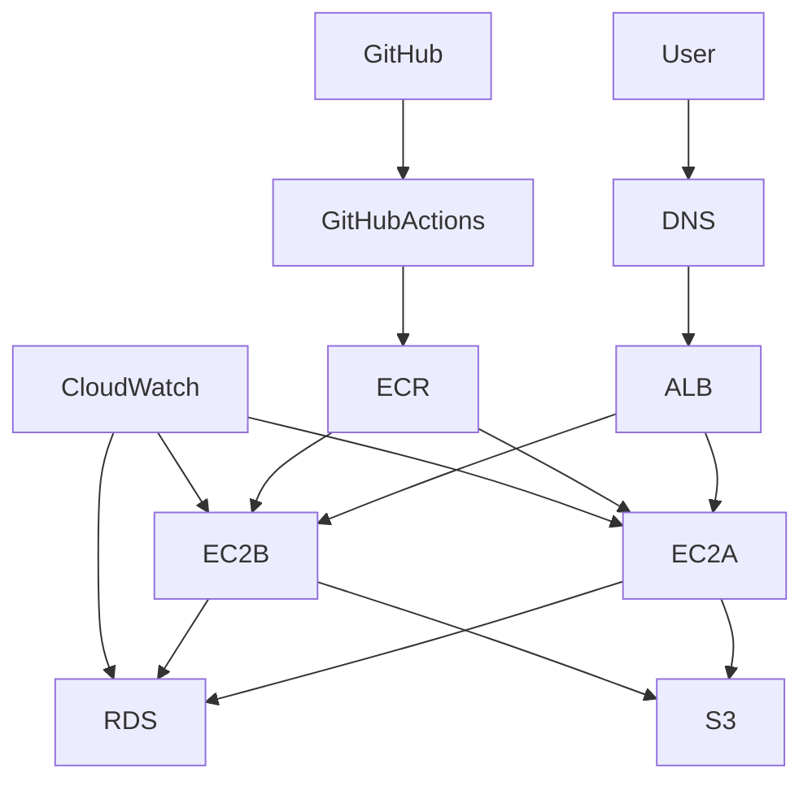

# Architecture

CloudBoard is designed to be a learning tool for AWS and DevOps.

## Mermaid Diagram

## Description
- **Frontend**: React SPA running in a user's browser, fetching data from the API.
- **API Backend**: A Go REST API running on EC2 instances or EKS pods.
- **Database**: Managed PostgreSQL (AWS RDS).
- **Storage**: AWS S3 for profile pictures.
- **Load Balancing**: AWS Application Load Balancer distributes traffic between instances.
- **Monitoring**: AWS CloudWatch.
